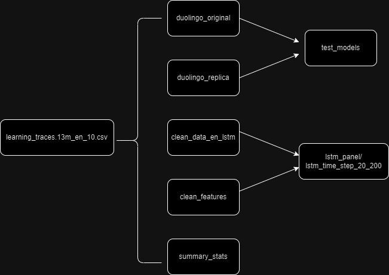

# NNLangRecall
- Reproduction of Existing Models: Goal: To accurately reproduce the results of the
Half Life Regression and Logistic Regression models as presented in the paper ”A
Trainable Spaced Repetition Model for Language Learning.” This involves
implementing and validating these models on a relevant dataset to ensure that our
foundational methodologies align with established research.
- Neural Network Implementation for Recall Probability: Goal: To extend the existing
analysis by implementing advanced neural network models as an alternative to the
traditional Logistic Regression approach for predicting the probability of recall in
language learning. This includes designing, training, and evaluating neural network
architectures to assess their effectiveness in this context.
* Find all the scripts in the src folder.

